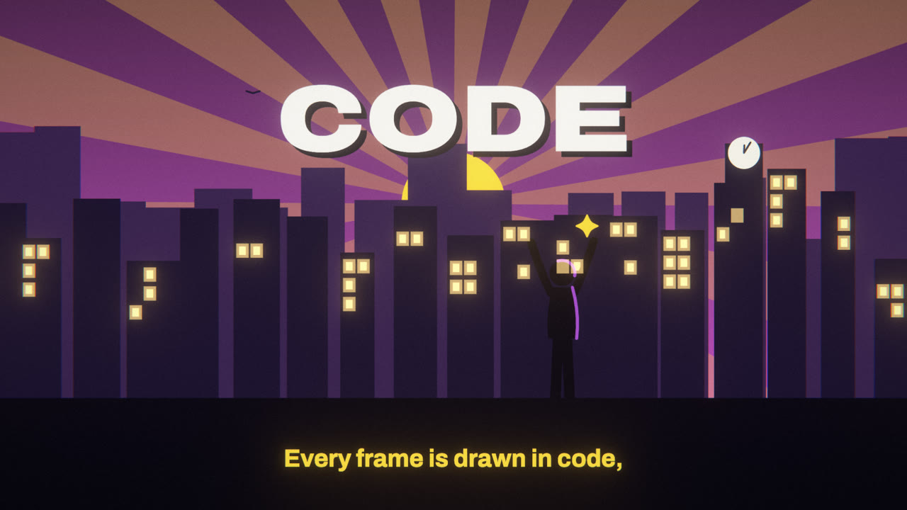

# drawn in code

A toolchain and a method for making music videos in which every frame is drawn in code. The song comes from an AI
music generator; the words, timing analysis, design and code are written with Claude; a human directs.

The output is a 3840×2160, 60 fps film with motion blur, where:
- every sung word is on screen at the moment it is sung;
- every cut lands on the beat;
- a character with a face acts every line.

It was built for one brief and is written down here so the next film starts further on.



## What is here

| Path | What it is |
|---|---|
| `METHOD.md` | The method end to end: from a brief to words, takes, timing, treatment, a shared kit, parallel plates, gates, checks and the final render |
| `DIRECTION.md` | How to set and hold an artistic direction: palettes, type, the readable lyric, environments with clues, a character who acts (anime faces, chibi pops, lines of force), silhouettes that emote, motifs, camera grammar, the compositor's restraint, variants |
| `MUSIC.md` | The link between the lyric (Claude), the song (Suno, or another generator) and the timing |
| `LESSONS.md` | What broke, how it was found and the fix, with numbers |
| `PRIOR-ART.md` | Whose work this stands on, the nearest prior art to each part, the licences that matter, and what is not new; the verified surveys are in `research/` |
| `memory/` | The working rules in Claude Code memory format, to copy into a project's memory |
| `templates/` | A treatment, a variants plan, a scene guide, a brief for a plate author, and `plates.json` |
| `engine/` | The renderer: TypeScript scenes on Canvas2D and three.js, rendered offline in headless Chromium and encoded in the page with WebCodecs. It includes the shared kit (`src/scenes/_motifs.ts`, `_manga.ts`, `_post.ts`) and a demo scene. |
| `analysis/` | The timing pipeline: Demucs stems, CTC forced alignment, a whisper cross-check, the beat grid, bars and sections |
| `tools/` | Measuring tools (`palette.py`, `song-analyze.py`, `dynamics.py`, `srt-lines.py`, `srt-check.py`), `soundtrack.py`, `make-demo-take.py`, the storyboard page (`boards.py`), the final render (`render-final.sh`) and its memory guard (`memwatch.py`) |
| `takes/` | One folder per take: the master WAV and its analysis. `takes/demo/` is made by `tools/make-demo-take.py`. |
| `examples/stone/` | The worked example: one brief, three films, every treatment, guide, timeline and scene file |

## Try it

You need [bun](https://bun.sh) and FFmpeg. The renderer drives Playwright's Chromium:

```bash
python3 tools/make-demo-take.py
cd engine
bun install
bunx playwright-core install chromium chromium-headless-shell
bun scripts/render.ts stills --take demo --t 3.6,10.1 --out ../out/demo
bun scripts/render.ts video --take demo --out ../out/demo.mp4
cd ..
TAKE=demo tools/render-final.sh
```

The last command writes `out/final/demo-4k60.mp4`.

To preview in a browser, run `bunx vite` in `engine/` and open `http://localhost:5173/?take=demo`.

## Making a film

Read `METHOD.md`, then `DIRECTION.md`, then `examples/stone/README.md`. The short version:

1. **Write.** Write the lyric for the generator (`MUSIC.md`). Generate takes, and choose by ear.
2. **Time.** Decode the take to `takes/<take>/audio.wav`, write the sung lines to `lyrics.src.json`, then run
   `TAKE=<take> analysis/run-take.sh` and `analysis/analyze.py`.
3. **Script.** Write the treatment and its shot-by-shot script, and commit them (`templates/TREATMENT.md`).
4. **Build the shared kit.** Build the character, sets, cast and lyric presenter, look-test them, then freeze the
   kit.
5. **Plates.** List the plates in `takes/<take>/plates.json` (or a TypeScript timeline). Build them in parallel from
   a scene guide (`templates/SCENE-GUIDE.md`).
6. **Gates.** Storyboard gate, then a 1080p preview, then `TAKE=<take> tools/render-final.sh`. Verify the result
   before you deliver.

## Requirements and platform

- **Engine:** bun, Playwright's Chromium (WebCodecs H.264 with hardware encoding) and FFmpeg.
- **Analysis:** Python 3.12+ with [uv](https://docs.astral.sh/uv/); a GPU helps but is not required.
  - **The alignment fuses two acoustic models.** MMS_FA's weights are licensed **CC-BY-NC 4.0 (non-commercial)**;
    wav2vec2 LV60K is MIT. For commercial work, set `ALIGN_MODELS=lv60k` to use the MIT model alone. On one take this
    put 560 of 571 words within 0.1 s of the two-model result; the worst word was off by 0.74 s.
  - The models run where `common.device()` says (MPS on Apple silicon, CUDA when present, else the CPU); set
    `ANALYSIS_DEVICE` to choose.
  - The whisper cross-check uses mlx-whisper on Apple silicon and openai-whisper everywhere else; `uv sync` installs
    the right one.
- **Platform:** developed on a 16 GB Apple-silicon laptop running macOS, and run end to end on a 16 GB Intel MacBook
  Pro (macOS 15) on 2026-10-05:
  - **Intel Macs** install PyTorch 2.2.2 (its last x86_64 macOS wheels), numpy 1.26 and Python 3.12; `uv sync` picks
    these by itself. On an i9-9880H the CPU took 13 min for Demucs on a 5:20 take.
  - **Homebrew has no Intel bottles** for ffmpeg, bun or uv now (it builds them from source and upgrades its Python).
    Static builds work: ffmpeg from evermeet.cx (linked from ffmpeg.org), bun's release zip, uv's installer.
  - **Two GPUs:** headless Chromium may take the integrated one. `bun scripts/render.ts gpu` prints which; on a Mac set
    `FILM_CHROME_ARGS=--force_high_performance_gpu` (it moved an Intel UHD 630 to an RX 6600 eGPU and halved the frame
    time).
  - `tools/memwatch.py` reads macOS memory statistics (`vm_stat`, `sysctl`, `top`).

## Credits

- **The engine and analysis** are forked from [pdoom-video](https://github.com/mexicat/pdoom-video) by Giacomo
  Magnanini (MIT; `engine/LICENSE-pdoom-video.txt`, `analysis/LICENSE-pdoom-video.txt`). That repository had already
  solved the hard parts: offline rendering with motion blur, word-level forced alignment for sung vocals, and a scene
  API built for music.
- **Fonts:** Archivo, Cormorant Garamond, IBM Plex Mono and EB Garamond, under the SIL Open Font License
  (`engine/public/fonts/FONTS.md`).
- **Made by** Knight Commander Gareth (direction) and Claude (Anthropic): words, analysis, design and code.
